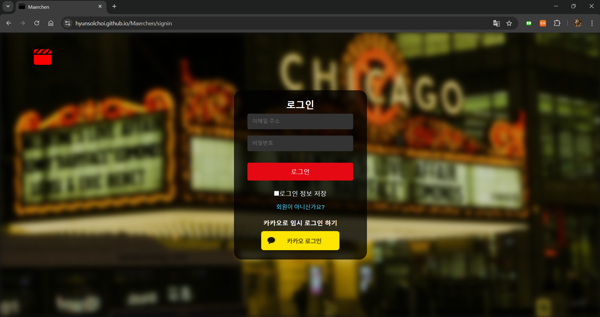
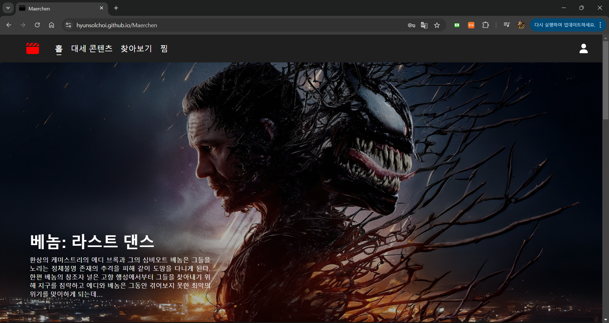

# Maerchen

**Maerchen**, **Märchen** meaning "fairy tale" or "story" in German, is a comprehensive movie information platform.  
This project was created as the **second assignment** for the **Web Service Design course**.  
Leveraging the TMDB API, Maerchen provides users with access to a wide range of movie posters and detailed information.  
It also offers personalized movie recommendations tailored to the user's preferences, making it easy to discover new favorites and explore the world of cinema.

## Deployment Link

You can access the live version of **Maerchen** here:  
[Maerchen - Live Website](https://hyunsolchoi.github.io/Maerchen/signin)

## Installation and Setup

Follow these steps to set up and run the Maerchen project locally:


### Prerequisites

- Ensure that Node.js is installed on your system.
- A package manager such as npm (comes with Node.js) or yarn.

---

### Installation


1. Clone the repository:
```bash
git clone https://github.com/your-username/Maerchen.git
cd Maerchen
```

2. Install the dependencies:
```bash
npm install
```
### Running the Development Server
To start the development server, run: 
```bash 
npm start 
``` 
The application will be available at http://localhost:3000.

### Building for Production
To create a production build, run: 
```bash
 npm run build 
 ``` 
The optimized files will be placed in the build directory. 

### Deployment
To deploy the application to GitHub Pages, run: 
```bash 
npm run deploy 
``` 
The site will be deployed to: https://hyunsolchoi.github.io/Maerchen/ 

### Running Tests
To run the test suite, execute: 
```bash
 npm run test 
```

### Ejecting the Application
 To gain full control of the app’s configuration, you can eject it: 
 ```bash 
 npm run eject 
 ``` 
**Note:** This action is irreversible. Once ejected, you’ll be responsible for maintaining all configurations. 

## Tech Stack

### Frontend
- **React**: A JavaScript library for building user interfaces
- **React Router**: For handling navigation between pages
    - **BrowserRouter**: Used for managing routing with clean URLs
- **TypeScript**: Ensures type safety and maintainability
- **TMDB API**: Provides movie data and resources

### Styling
- **CSS**
- **FontAwesome**: Icon library for UI enhancement

### Development Environment
- **WebStorm**: Primary development tool
- **React TypeScript Template**: Used as the project starter template
- **TSX Files**: For component and code structure

### Deployment
- **GitHub Pages**: For static site hosting
- **React Scripts**: Provides scripts for running, building, testing, and ejecting the React application

## Features
- **Browse Movies**: View a wide range of movie posters and details fetched from the TMDB API.
- **Personalized Recommendations**: Get movie suggestions tailored to user preferences.
- **User Authentication**: Sign up, log in, and manage user accounts securely.
- **Responsive Design**: Optimized for various screen sizes and devices.
- **Interactive Navigation**: Smooth navigation between pages using React Router and BrowserRouter.
- **Movie Categories**: Explore movies sorted by genre, popularity, and trending status.
- **Toast Notifications**: Get real-time feedback on user actions (e.g., login success or error).


## Folder Structure

```plaintext
.github/
└── workflows/
    ├── auto-deploy.yml        # Automates building, Deploying GitHub Pages, Synchronizing Main
    ├── develop-to-main.yml    # Handles merging from develop to main branch
    └── feature-check.yml      # Automatically merges feature branches into the develop branch
public/
├── 404.html                   # Custom 404 error page
├── favicon.ico                # Favicon for the website
├── index.html                 # Main HTML file for the React application
└── robots.txt                 # SEO configuration and web crawler instructions
src/
├── components/                # Page-specific components
│   ├── home/                  # Components related to the Home page
│   ├── popular/               # Components related to the Popular page
│   ├── search/                # Components related to the Search page
│   ├── signIn/                # Components related to the SignIn page
│   └── wishlist/              # Components related to the Wishlist page
├── config/                    # Configuration files and assets
│   └── res/                   # Resources, such as images
│       └── background.jpg     # Background image used in the signin page
├── reusableComponents/        # Reusable UI components
│   ├── Loader.tsx             # Loader component
│   ├── Loader.css             # Styles for the Loader component
│   ├── Navbar.tsx             # Navbar component
│   └── Navbar.css             # Styles for the Navbar component
├── utils/                     # Utility functions
│   ├── toggleWish.tsx         # Logic for toggling wishlist items
│   └── validateApiKey.tsx     # Utility to validate the TMDB API key
├── views/                     # Styling for specific views
│   ├── infiniteView.css       # Styles for infinite scrolling views
│   ├── tableView.css          # Styles for table views
│   ├── toast.css              # Styles for toast notifications
│   └── interfaces.tsx         # TypeScript interfaces for data types
├── App.tsx                    # Main application component
├── index.tsx                  # Entry point of the application
├── index.css                  # Global styles
└── reportWebVitals.ts         # Performance reporting script
.gitignore                     # Git ignore rules
asset-manifest.json            # Metadata for build assets
package.json                   # Project configuration and dependencies
package-lock.json              # Lockfile for npm dependencies
README.md                      # Project documentation
tsconfig.json                  # TypeScript configuration file
```
## API Information

### TMDB API
This project uses the [TMDB API](https://www.themoviedb.org/documentation/api) to fetch movie data, including posters, descriptions, and personalized recommendations.

In this application, the TMDB API key also serves as the **password** for user authentication. This ensures that only valid API key holders can register and log in to use the website.

### Setting Up the API Key
1. Sign up for a free account on [TMDB](https://www.themoviedb.org/).
2. Navigate to your account settings and generate an API key under the "API" section.
3. Use the API key as your **password** when signing up or logging into the website.
    - The system will validate the API key's authenticity.
    - Invalid API keys will result in login or registration failure, and users won't be able to access the website's features.

### Key Endpoints Used
- **Fetch Popular Movies**:  
  Endpoint: `https://api.themoviedb.org/3/movie/popular?api_key={API_KEY}&language=ko-KR`  
  Parameters:
    - `api_key`: Your API key
- **Fetch Latest Movies**:  
  Endpoint: `https://api.themoviedb.org/3/movie/now_playing?api_key={API_KEY}&language=ko-KR`  
  Parameters:
    - `api_key`: Your API key
- **Fetch Movies by Genres**:  
  Endpoint: `https://api.themoviedb.org/3/discover/movie?api_key={API_KEY}&with_genres={GENRE}&language=ko-KR`  
  Parameters:
    - `api_key`: Your API key
    - `with_genres`: Genre codes to filter movies by (e.g., `28` for Action, `35` for Comedy)
- **Search Movies**:  
  Endpoint: `https://api.themoviedb.org/3/discover/movie?api_key={API_KEY}
                                  &language=ko-KR&page={PAGE}
                                  &with_genres=${GENRE}
                                  &release_date.lte=${DATE}
                                  &vote_average.gte=${VOTE}
                                  &with_original_language=${LANGUAGE}`  
  Parameters:
    - `api_key`: Your API key
    - `language`: Language code for the returned data (e.g., `ko-KR` for Korean, `en-US` for English)
    - `page`: Page number for pagination (default: `1` Maximum: `500`)
    - `with_genres`: Genre codes to filter movies by (e.g., `28` for Action, `35` for Comedy)
    - `release_date.lte`: Filters movies released on or before a specific date (`YYYY-MM-DD`)
    - `vote_average.gte`: Minimum vote average to filter movies (e.g., `7.0`)
    - `with_original_language`: Original language of the movie (e.g., `ko` for Korean, `en` for English)
- **Fetch Movies by Genres**:  
  Endpoint: `https://api.themoviedb.org/3/movie/popular?api_key=${API_KEY}&language=ko-KR&page=${page}`  
  Parameters:
    - `api_key`: Your API key
    - `page`: Page number for pagination (default: `1` Maximum: `500`)

### Notes
- **Important**: Ensure you keep your API key private and secure.
- Invalid API keys will block access to the site, preventing both registration and login.
- For more detailed documentation, refer to the [TMDB API Docs](https://developers.themoviedb.org/3/getting-started/introduction).

## Screenshots and Demo

### Screenshots
Below are some screenshots showcasing the key features of **Maerchen**:

1. **Sign-In Page**
   

   
2. **Home Page**
   


### Notes
- Screenshots are subject to change as the application evolves.
- Ensure all assets (images) are accessible and properly linked.

## Known Issues

1. **Poster Hover Effect**
  - Issue: When hovering over a movie poster on the homepage, the neighboring posters sometimes shift slightly out of alignment.
  - Cause: This issue likely stems from inconsistent CSS styles applied to the hover effect or margin/padding adjustments during the hover state.
  - Status: Currently under investigation. A fix will be implemented in a future update.

---

### How to Report Issues
If you encounter additional issues, please report them by creating a [GitHub Issue](https://github.com/HyunsolChoi/Maerchen/issues) with a detailed description and, if possible, screenshots or steps to reproduce the issue.


## Learn More About React

You can learn more in the [Create React App documentation](https://facebook.github.io/create-react-app/docs/getting-started).

To learn React, check out the [React documentation](https://reactjs.org/).

## Updated KakaoLogin

You can also login with kakao-account without register.

The nickname and profile image are used for storing and displaying user information.


# Thanks for being here !